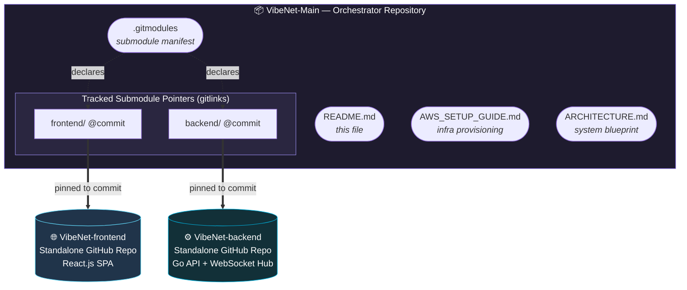
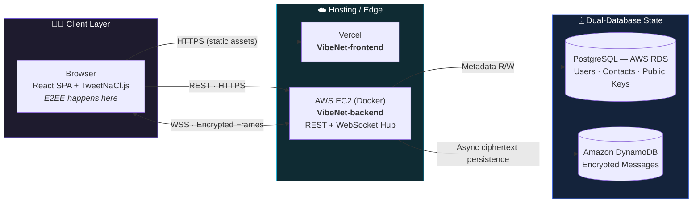

<div align="center">

# VibeNet — End-to-End Encrypted Real-Time Chat Ecosystem

<p>
  
  
  
</p>
<p>
  
  
  
</p>

**The orchestrator repository for VibeNet — a scalable, WhatsApp-style chat platform with true End-to-End Encryption.**

[Architecture](#-ecosystem-architecture--visualizations) · [Why Submodules?](#-why-multi-repo--submodules) · [Navigation](#-repository-navigation-map) · [Setup](#-local-environment-cloning--setup)

</div>

---

## Overview

**VibeNet-Main** is the **orchestrator repository** that unifies the VibeNet platform into a single, coherent development workspace. It does not host application code directly — instead, it tracks two independent, standalone repositories as **Git Submodules** and centralizes the shared architecture documentation and cloud provisioning guides.

VibeNet itself is a real-time chat application where the server acts strictly as a **blind router**: it authenticates users, relays opaque ciphertext, and stores encrypted payloads — but **never decrypts, inspects, or logs plain-text messages**. Encryption and decryption happen entirely on the client using **TweetNaCl.js**.

> [!NOTE]
> This repository is the *entry point* for the ecosystem. Clone it recursively (see [Setup](#-local-environment-cloning--setup)) to pull the frontend and backend in one unified workspace.

---

## 🏗 Ecosystem Architecture & Visualizations

### Diagram A — Repository Topology (Submodule Orchestration)

This map shows how `VibeNet-Main` orchestrates the ecosystem: it owns the `.gitmodules` manifest and shared docs, while pinning each submodule folder to a specific commit in its own standalone GitHub repository.



### Diagram B — Structural Runtime View (Client → Edge → Dual-DB State)

This diagram maps the deployed runtime: the browser talks to a Vercel-hosted frontend and an EC2-hosted Go backend, which persists relational metadata and encrypted message history across two purpose-built databases.



> [!IMPORTANT]
> The backend is intentionally **content-blind**. It routes and stores only ciphertext and cryptographic metadata (`nonce`). Plain-text messages are never stored, logged, or processed server-side.

---

## 🤔 Why Multi-Repo + Submodules?

VibeNet deliberately adopts a **multi-repository architecture stitched together with Git Submodules**, rather than a single flat monolith. This is a considered architectural decision, not an accident of history:

- **Separation of Concerns** — The React frontend and the Go backend have fundamentally different toolchains, dependency graphs, test suites, and release cadences. Isolating them into standalone repositories keeps each codebase focused, navigable, and free of cross-domain noise.

- **Decoupled Deployment Pipelines** — Each repository owns its own CI/CD. A push to `VibeNet-frontend` triggers a **Vercel** deployment; a push to `VibeNet-backend` triggers a **Docker image build deployed to AWS EC2**. Neither pipeline blocks or contaminates the other, enabling truly independent release velocity.

- **Efficient Repository Boundaries** — Contributors can clone, build, and iterate on a single component without downloading the entire ecosystem. Access, issues, and versioning are scoped cleanly per repository.

- **Unified Local Workspace** — Despite living in separate repositories, `VibeNet-Main` reassembles the full stack into **one coherent local checkout** via submodules. Developers get the best of both worlds: strict boundaries in the cloud, a single integrated workspace on their machine.

> [!TIP]
> Submodule pointers are **commit-pinned**. `VibeNet-Main` always references an exact, reproducible commit of each component — so a fresh recursive clone yields a known-good, buildable snapshot of the entire platform.

---

## 🗺 Repository Navigation Map

```text
VibeNet-Main/
├── .gitmodules              # Submodule manifest — declares URLs & paths
├── README.md               # This orchestrator overview
├── ARCHITECTURE.md         # Deep system design & E2EE blueprint
├── AWS_SETUP_GUIDE.md      # Step-by-step cloud infrastructure provisioning
│
├── backend/  → (Git Submodule)  ➜  VibeNet-backend
└── frontend/ → (Git Submodule)  ➜  VibeNet-frontend
```

| Path | Type | Responsibility |
|------|------|----------------|
| **`/backend`** | Git Submodule | Go core — REST APIs, JWT + Google OAuth, WebSocket Hub, and the dual PostgreSQL / DynamoDB persistence handlers. |
| **`/frontend`** | Git Submodule | React single-page application — E2EE key generation & management (TweetNaCl.js), real-time chat UI, and Tailwind CSS layout. |
| **`AWS_SETUP_GUIDE.md`** | Document | Beginner-friendly, step-by-step provisioning for JWT, Google OAuth, AWS RDS (PostgreSQL), DynamoDB, and IAM credentials. |
| **`ARCHITECTURE.md`** | Document | The system blueprint: dual-database strategy, E2EE message flow, and anti-spam design. |

---

## 🚀 Local Environment Cloning & Setup

### 1. Recursive Clone (recommended)

Fetch the orchestrator **and** both submodules in a single command:

```bash
git clone --recursive https://github.com/ChamathDilshanC/VibeNet-Main.git
cd VibeNet-Main
```

> [!NOTE]
> The `--recursive` flag ensures `frontend/` and `backend/` are populated in the same operation. Without it, those folders would clone as empty placeholders.

### 2. Already cloned without `--recursive`?

If you cloned the main repo first and the submodule folders are empty, initialize them:

```bash
git submodule update --init --recursive
```

### 3. Keeping submodules in sync

To pull the latest commits for every submodule from their respective remotes:

```bash
git submodule update --init --recursive --remote
```

> [!WARNING]
> After `--remote` advances a submodule to a newer commit, that change appears as a modified gitlink in `VibeNet-Main`. Commit it here to **pin the ecosystem to the updated versions** — otherwise collaborators will still resolve the older pinned commits.

### 4. Configure & run each component

Each submodule ships its own README with detailed instructions. In brief:

```bash
# Backend — provision your .env first (see AWS_SETUP_GUIDE.md)
cd backend && cp .env.example .env && go run ./cmd/api

# Frontend
cd ../frontend && npm install && npm run dev
```

---

<div align="center">

### Architected and developed by **Chamath Dilshan** ([@ChamathDilshanC](https://github.com/ChamathDilshanC))

<sub>VibeNet — Secure by design. Encrypted end-to-end. Built to scale on the AWS Free Tier.</sub>

</div>
